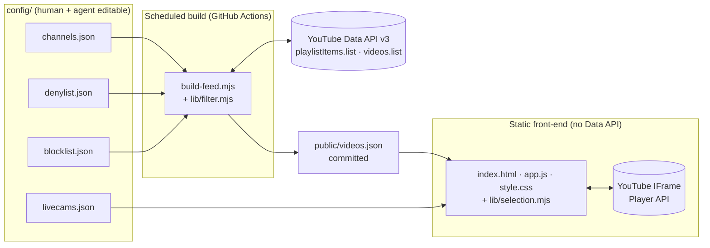
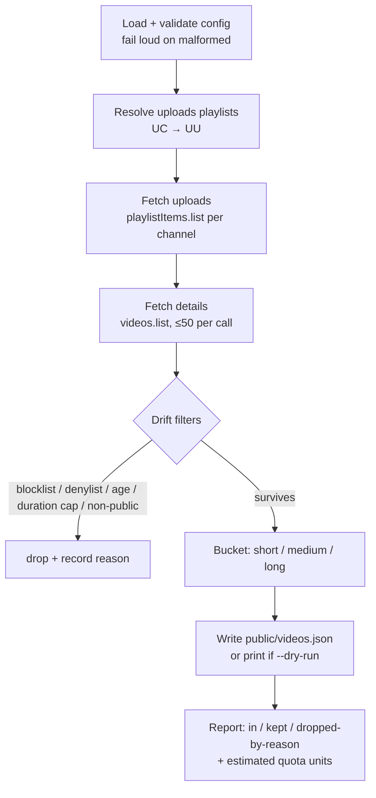
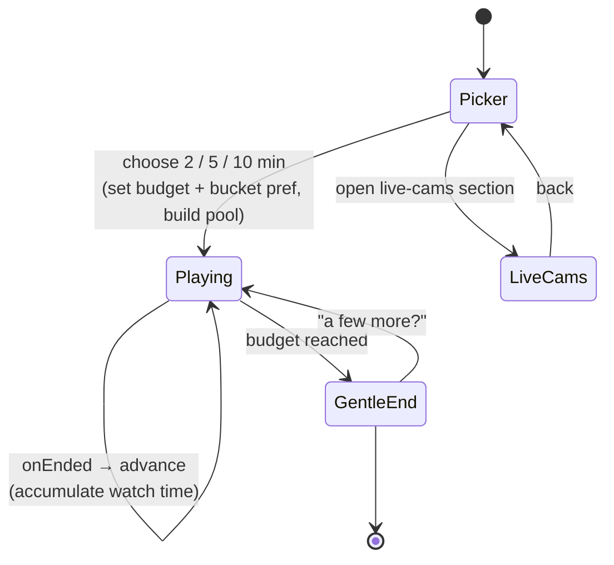

# feat: Wholesome Animal Video Feed (v1 build)

**Origin:** `docs/refs/SPEC.md` — a complete build spec. This plan enriches it into implementation units. Product Contract preservation: origin scope carried forward unchanged; the two optional features (live-cams, report-this-video) were promoted into v1 scope by user decision during planning.

---

## Summary

Build, from an empty directory and first commit, a self-maintaining web tool that plays a short, intention-driven feed of curated animal videos. The system splits into two halves joined by a static `public/videos.json` seam:

- A **scheduled Node build** (GitHub Actions) reads channel config, pulls recent uploads via the YouTube Data API using only 1-unit calls, filters for drift, buckets by duration, and commits `videos.json` back to the repo.
- A **fully static front-end** fetches `videos.json`, offers a "Got 2 / 5 / 10 minutes?" intention picker, plays videos through the YouTube IFrame Player API with auto-advance, and ends warmly. It makes **no** Data API calls, so it exposes no key and consumes no quota.

v1 includes both optional features: a hardcoded **live-cams** section and a **report-this-video** affordance.

---

## Problem Frame

Algorithmic video feeds are engineered to maximize watch time; there is no low-effort, guilt-free way to watch a *little* wholesome content and stop. This tool inverts that: the viewer states an intention up front, the tool honors it, and it ends gently. The maintenance burden must stay near zero — new content appears automatically as curated channels post, and the only routine human edits are a rarely-touched channel list and an occasional blocklist entry.

The central architectural constraint that shapes everything: **all secrets, API cost, and filtering live in the scheduled build; the deployed site is dumb, static, and safe.** This is what keeps the tool free regardless of traffic and keeps a key from ever reaching the browser.

---

## Requirements

Traced from `docs/refs/SPEC.md`. IDs are plan-local.

**Content pipeline**
- **R1** — Discover videos strictly by channel uploads, never `search.list`. Derive each channel's uploads playlist by swapping the leading `UC` for `UU`; page it with `playlistItems.list` (1 unit / 50 videos).
- **R2** — Fetch duration + snippet metadata in batches of ≤50 via `videos.list` (`part=contentDetails,snippet,status`). The `status` part is required so R3's non-`public`/unavailable drop can read `privacyStatus`.
- **R3** — Apply drift guardrails: drop blocklisted IDs; drop title/description denylist keyword matches (case-insensitive substring); drop videos older than `maxAgeMonths`; drop duration outliers over a hard cap (default 20 min); drop non-`public`/unavailable videos when detectable.
- **R4** — Bucket each surviving video as `short` (<60s), `medium` (60s–4min), `long` (4–20min) from parsed ISO-8601 duration.
- **R5** — Write flat `public/videos.json` with a top-level `generatedAt` and the documented per-video schema.
- **R6** — Emit an evidence-based report: counts in / kept / dropped, plus a dropped-by-reason breakdown. `--dry-run` writes nothing and prints the full report; `--verbose` prints per-video decisions to STDERR.
- **R7** — Read the API key only from `process.env.YOUTUBE_API_KEY`; never hardcode or commit it. Log estimated quota units consumed; make blowing the quota structurally near-impossible.
- **R8** — Fail loudly (clear message + nonzero exit) on malformed config or API failure; errors to STDERR.

**Config surface (agent- and human-editable)**
- **R9** — `config/channels.json`: channel list with `id`, `label`, `trust` (advisory; preserved even if unused in v1), plus `maxVideosPerChannel` and `maxAgeMonths`.
- **R10** — `config/denylist.json`: case-insensitive keyword list, conservatively seeded, with a `notes` field.
- **R11** — `config/blocklist.json`: `videoIds` array of manual per-video overrides, with `notes`.
- **R12** — `config/livecams.json`: hardcoded live-stream embed entries for the live-cams section.

**Automation**
- **R13** — `.github/workflows/refresh-feed.yml`: `schedule` (daily cron) + `workflow_dispatch`; checkout → setup Node → `npm ci` → run build with key from `secrets.YOUTUBE_API_KEY` → commit `public/videos.json` back if changed, using a least-privilege token.

**Front-end**
- **R14** — Intention picker (2 / 5 / 10 min) setting a session budget and a bucket preference; selection degrades gracefully to adjacent buckets when one is thin.
- **R15** — Shuffle the eligible pool and play sequentially via the IFrame Player API, auto-advancing on video end, tracking cumulative watch time (or count) against the budget.
- **R16** — Gentle end screen when the budget is reached: warm copy + a single low-key "a few more?" affordance. No counters, no shaming, no infinite scroll.
- **R17** — Warm, calm, uncluttered UI; responsive and usable one-handed on a phone; respects `prefers-reduced-motion`; minimal chrome during playback.
- **R18** — Live-cams: a separate, clearly-labeled section of persistent live streams sourced from `config/livecams.json`, outside the uploads pipeline.
- **R19** — Report-this-video: a low-key affordance (mailto or simple form) that hands the maintainer a video ID to add to `blocklist.json`.

**Docs / guardrail honesty**
- **R20** — `README.md`: Google Cloud project + YouTube Data API v3 enablement + key generation, Actions secret + local `.env` setup, local dev run, how to add channels / tune denylist / block a video, deploy notes for a static host (default GitHub Pages, host-agnostic), and the explicit metadata-only guardrail caveat.

### Success Criteria

- `YOUTUBE_API_KEY=… node scripts/build-feed.mjs --dry-run` produces a sensible drop report against placeholder channels without writing a file.
- A real run writes a schema-valid `public/videos.json` with buckets populated and `generatedAt` set.
- The static site, served from `public/` with no build step, plays a 2/5/10-minute session end-to-end and ends on the gentle screen.
- Estimated quota per full run is a few dozen units — a rounding error against the 10,000/day free tier — and `search.list` is never called.

---

## Assumptions (defaults confirmed during planning)

- **Cron frequency:** daily.
- **Static host:** README defaults to GitHub Pages; layout stays host-agnostic (`videos.json` committed so any static host works with no build step).
- **Session lengths → buckets:** 2 min favors `short`; 5 min mixes `short`/`medium`; 10 min mixes `medium`/`long`. Exact mapping lives in a single tunable constant table in the selection module.
- **Both optional features ship in v1:** live-cams (R18) and report-this-video (R19).
- **Runtime:** Node 20+ (uses global `fetch` and the built-in `node:test` runner — no runtime dependencies). CI pins Node 22.

---

## Key Technical Decisions

- **KTD1 — Zero runtime dependencies; vanilla JS front-end, ESM Node build.** Matches the spec's dependency-free goal and keeps the static host trivial. `package.json` sets `"type": "module"`; no framework, no bundler.
- **KTD2 — Global `fetch`, no HTTP client library.** Node 20+ ships `fetch`; avoids `node-fetch`/`axios`. Documented as the Node-version floor. *Rationale:* fewer deps, less supply-chain surface, simpler `npm ci` in CI.
- **KTD3 — Built-in `node:test` + `node:assert` for tests.** No Jest/Vitest install. Keeps the "dependency-free" promise while still giving the drift filters real coverage.
- **KTD4 — Pure logic factored into importable ES modules.** Filtering/bucketing (`scripts/lib/filter.mjs`) and front-end selection (`public/lib/selection.mjs`) are pure functions with no I/O or DOM, imported by both the runtime and `node:test`. *Rationale:* the drift guardrails and session selection are the two error-prone cores; making them pure makes them testable without the network or a browser. Governs R3, R4, R14.
- **KTD5 — Discovery strictly via uploads-playlist paging; `search.list` is structurally absent.** The build never imports or calls a search path. Quota guard: a hard ceiling on total `playlistItems`/`videos` calls derived from config, logged every run. Governs R1, R7.
- **KTD6 — `public/videos.json` is committed, not gitignored.** The Action commits it back so the static host redeploys with no build step of its own. Governs R5, R13.
- **KTD7 — Commit-back uses the default `GITHUB_TOKEN` with `permissions: contents: write`.** Least privilege, no PAT to manage. Governs R13.
- **KTD8 — Guardrails are metadata pattern-matching only.** Allowlist (channels) + denylist (keywords) + blocklist (manual) + age/duration bounds. No vision/LLM pass. Stated as an accepted v1 limitation in the README. Governs R3, R20.

---

## High-Level Technical Design

### System components and the static seam



The dashed line of the architecture is `videos.json`: everything left of it is secret-bearing and runs on a schedule; everything right of it is public, static, and keyless. `livecams.json` is read directly by the front-end because live streams never flow through the uploads pipeline.

### Build pipeline (sequential, separable steps)



### Front-end session flow



---

## Output Structure

```
squishy/
├── config/
│   ├── channels.json          # curated channel IDs (main maintenance surface)
│   ├── denylist.json          # title/description keyword filters
│   ├── blocklist.json         # manual per-video overrides
│   └── livecams.json          # hardcoded live-stream embeds
├── scripts/
│   ├── build-feed.mjs         # scheduled build entrypoint (CLI, I/O, API)
│   └── lib/
│       └── filter.mjs         # pure: denylist match, age, duration parse, bucket
├── public/
│   ├── index.html
│   ├── app.js                 # picker → IFrame playback → end screen
│   ├── style.css
│   ├── videos.json            # GENERATED; committed by the Action
│   └── lib/
│       └── selection.mjs      # pure: pool build, bucket preference, graceful fallback
├── test/
│   ├── filter.test.mjs
│   └── selection.test.mjs
├── .github/workflows/
│   └── refresh-feed.yml
├── .gitignore
├── .env.example
├── package.json
└── README.md
```

*(Scope declaration, not a constraint — the implementer may adjust layout if implementation reveals a better shape. Per-unit `Files` lists remain authoritative.)*

---

## Implementation Units

### Phase A — Foundation

### U1. Repo scaffold and project metadata

- **Goal:** An initialized git repo with the directory skeleton, `package.json`, ignore rules, and an env template — the ground the rest builds on.
- **Requirements:** R7 (env-based key groundwork), KTD1, KTD2, KTD3.
- **Dependencies:** none.
- **Files:** `package.json`, `.gitignore`, `.env.example`, `README.md` (stub), and empty `config/`, `scripts/lib/`, `public/lib/`, `test/`, `.github/workflows/` directories.
- **Approach:**
  1. `git init`; first commit is the scaffold.
  2. `package.json`: `"type": "module"`, `"engines": { "node": ">=20" }`, scripts `"build": "node scripts/build-feed.mjs"` and `"test": "node --test"`. No dependencies.
  3. `.gitignore`: `.env`, `node_modules/`. **Do not** ignore `public/videos.json` (KTD6).
  4. `.env.example`: `YOUTUBE_API_KEY=` with a one-line comment.
- **Patterns to follow:** the repository layout table in `docs/refs/SPEC.md`.
- **Test scenarios** — `Test expectation: none — scaffolding only. Verify `npm test` exits 0 with no tests and `node -e "import('./package.json', {with:{type:'json'}})"` style load succeeds.`
- **Verification:** `npm run build` fails with the intended "missing config/key" error (not a syntax error), confirming the entrypoint is wired.

### U2. Config files with documented schemas and placeholders

- **Goal:** All four config files seeded with valid, clearly-marked placeholder content that a human or agent can edit without touching code.
- **Requirements:** R9, R10, R11, R12.
- **Dependencies:** U1.
- **Files:** `config/channels.json`, `config/denylist.json`, `config/blocklist.json`, `config/livecams.json`.
- **Approach:**
  1. `channels.json` — 2 placeholder channels with obviously-fake `UCxxxx…` IDs labeled "REPLACE ME", `trust` set, plus `maxVideosPerChannel: 20`, `maxAgeMonths: 12`.
  2. `denylist.json` — seed with the spec's conservative keyword set (`urgent`, `please help`, `gofundme`, `rainbow bridge`, `rip `, `politics`, `election`, …) plus a `notes` field.
  3. `blocklist.json` — empty `videoIds: []` with a `notes` line.
  4. `livecams.json` — 1–2 placeholder live-stream entries (`{ id, label }`) marked to replace.
- **Patterns to follow:** the JSON examples in `docs/refs/SPEC.md` §"Config files".
- **Test scenarios:** validity is exercised by U3's config-loader tests (fixtures mirror these shapes). No standalone test here.
  - `Test expectation: none — static data; covered transitively by U3.`
- **Verification:** each file parses as JSON; placeholder IDs are visually unmistakable so they cannot be mistaken for real channels.

### Phase B — Build pipeline

### U3. Config loading, validation, and CLI scaffolding

- **Goal:** `build-feed.mjs` loads and validates all config, parses `--dry-run`/`--verbose`, reads the key from env, and fails loud on any malformed input — before any network call.
- **Requirements:** R7, R8, R9–R12.
- **Dependencies:** U2.
- **Files:** `scripts/build-feed.mjs`, `scripts/lib/filter.mjs` (created here with the config-validation + pure helpers it will grow), `test/filter.test.mjs`.
- **Approach:**
  1. Parse argv for `--dry-run` and `--verbose` (no dependency — small hand-rolled parser).
  2. Read + `JSON.parse` each config file inside try/catch; on failure print a clear `config/<file>: <reason>` message to STDERR and `process.exit(1)`.
  3. Validate shape: `channels[].id` present and matching `^UC`, numeric `maxVideosPerChannel`/`maxAgeMonths`, array types for `keywords`/`videoIds`.
  4. Read `YOUTUBE_API_KEY`; if absent and not `--dry-run`-with-fixtures, fail loud (R7).
  5. Put pure, testable helpers in `scripts/lib/filter.mjs`: `parseIso8601ToSeconds`, `bucketFor`, `matchesDenylist`, `isTooOld`, `exceedsDurationCap`.
- **Execution note:** implement the pure helpers in `filter.mjs` test-first — they are the drift core and are cheap to characterize.
- **Patterns to follow:** spec §"Build script" steps 1 and the flags/error contract.
- **Test scenarios** (`test/filter.test.mjs`):
  - `parseIso8601ToSeconds("PT47S") === 47`, `"PT1M3S" === 63`, `"PT1H2M" === 3720`, and a malformed string returns `null`/throws predictably.
  - `bucketFor(47) === "short"`, `bucketFor(59) === "short"`, `bucketFor(60) === "medium"`, `bucketFor(240) === "medium"`, `bucketFor(241) === "long"`, `bucketFor(1200) === "long"`.
  - `matchesDenylist` is case-insensitive substring on title+description: `"RIP Buddy"` matches `"rip "`, `"Scripture study"` does **not** match `"rip "` (word-boundary intent via the trailing space seed), `"URGENT: help"` matches `"urgent"`.
  - `isTooOld(publishedAt, maxAgeMonths)` — a video 13 months old with cap 12 is dropped; 11 months old is kept; boundary at exactly the cap is deterministic.
  - `exceedsDurationCap(1201, 1200)` is true; `1200` is false.
  - Config validation: a `channels.json` missing `id`, or with an `id` not starting `UC`, is rejected with a message naming the file.
- **Verification:** `node scripts/build-feed.mjs --dry-run` against placeholder config reaches the "would fetch" stage or exits cleanly explaining what is missing; `npm test` passes.

### U4. YouTube API fetch — uploads resolution, uploads paging, detail batching

- **Goal:** Given validated config + key, collect candidate videos with full metadata using only 1-unit calls, with quota accounting.
- **Requirements:** R1, R2, R7 (quota logging).
- **Dependencies:** U3.
- **Files:** `scripts/build-feed.mjs` (fetch section), `scripts/lib/youtube.mjs` (thin API wrapper).
- **Approach:**
  1. For each channel, derive uploads playlist ID by swapping leading `UC`→`UU` (no `channels.list` call needed).
  2. `playlistItems.list` (`part=contentDetails`, `maxResults=50`) per channel, paging until `maxVideosPerChannel` reached or uploads exhausted; collect video IDs. **Never** import or call `search.list`.
  3. Batch IDs into groups of ≤50; `videos.list` (`part=contentDetails,snippet,status`) to get ISO-8601 duration, title, description, `publishedAt`, thumbnails, and `status.privacyStatus`.
  4. Maintain a running `quotaUnits` counter (1 per list call); expose it for the report.
  5. Hard ceiling: compute `maxPossibleCalls` from `channels × ceil(maxVideosPerChannel/50)` + detail batches; if a run would exceed a sane constant (e.g. 500 units), abort with a clear message (R7 runaway guard).
- **Execution note:** start with a failing test for the request-shaping functions (URL/params builder, ID batcher) using a stubbed `fetch`; the real network is not exercised in unit tests.
- **Patterns to follow:** spec §"Build script" steps 2–4 and §"Why this keeps us in the free tier".
- **Test scenarios:**
  - Uploads-ID derivation: `UCabc…` → `UUabc…`; a non-`UC` id is already rejected upstream (U3), assert the helper still only touches the 2-char prefix.
  - ID batcher: 130 IDs → 3 batches of 50/50/30; 0 IDs → 0 batches; exactly 50 → 1 batch.
  - Quota counter increments by exactly 1 per simulated list call; a config sized past the ceiling triggers the runaway abort before any fetch.
  - `Covers R1.` Request builder never emits a `search` endpoint path (assert the constructed URL contains `playlistItems`/`videos` only).
  - Stubbed `fetch` returning an API error body → surfaced as a loud failure with nonzero exit (R8), not a silent empty feed.
- **Verification:** with a real key, a live `--verbose` run logs per-channel fetch counts and a plausible quota total (a few dozen units).

### U5. Filter, bucket, write `videos.json`, and drop reporting

- **Goal:** Turn fetched candidates into a schema-valid `public/videos.json`, applying every drift guardrail and printing an evidence-based report; honor `--dry-run`.
- **Requirements:** R3, R4, R5, R6.
- **Dependencies:** U4.
- **Files:** `scripts/build-feed.mjs` (filter/write/report section), `scripts/lib/filter.mjs` (compose pipeline), `test/filter.test.mjs` (extend).
- **Approach:**
  1. Run each candidate through: blocklist ID drop → denylist keyword drop → age drop → duration-cap drop → non-`public`/unavailable drop. Record `{videoId, reason}` for every drop.
  2. Bucket survivors (`short`/`medium`/`long`) via `bucketFor`.
  3. Assemble the flat schema: top-level `generatedAt` (ISO), `videos[]` of `{ id, title, channel, durationSeconds, bucket, publishedAt, thumbnail }`.
  4. If `--dry-run`: print what *would* be written + the full drop report; write nothing. Else write `public/videos.json` (stable key order, 2-space indent).
  5. Report to STDOUT: total in / kept / dropped, and a dropped-by-reason breakdown; append estimated quota units.
- **Execution note:** the drop-reason accounting is the tuning surface — cover each reason path with a dedicated case so a future denylist edit has a safety net.
- **Patterns to follow:** spec §"Build script" steps 5–8 and the `videos.json` schema block.
- **Test scenarios:**
  - Blocklisted ID present in candidates → absent from output, drop reason `blocklist`.
  - Denylist hit on description only (title clean) → dropped, reason `denylist`; clean video survives.
  - Video older than `maxAgeMonths` → dropped `age`; fresh one kept.
  - 25-minute video → dropped `duration-cap`; 19-minute → kept and bucketed `long`.
  - `status.privacyStatus !== "public"` → dropped `unavailable`.
  - Report math: `in === kept + sum(dropped-by-reason)` for a mixed fixture (no double-counting; first-matching-reason wins deterministically).
  - `Covers R5.` Output validates against the schema: flat, `generatedAt` present, every video has all seven fields and a valid `bucket`.
  - `--dry-run` on a fixture writes no file (assert `public/videos.json` unchanged/absent) but prints the full report.
- **Verification:** `YOUTUBE_API_KEY=… node scripts/build-feed.mjs --dry-run` against placeholders prints a sensible drop report (spec deliverable); a non-dry run produces a schema-valid file.

### U6. GitHub Actions scheduled refresh with commit-back

- **Goal:** A daily (+ manual) workflow that runs the build with the secret key and commits an updated `videos.json` back, triggering the static host to redeploy.
- **Requirements:** R13.
- **Dependencies:** U5.
- **Files:** `.github/workflows/refresh-feed.yml`.
- **Approach:**
  1. Triggers: `schedule` (daily cron, e.g. `0 12 * * *`) + `workflow_dispatch`.
  2. `permissions: contents: write` (least privilege, KTD7); default `GITHUB_TOKEN`.
  3. Steps: `actions/checkout` → `actions/setup-node` (node-version 22, `cache: npm`) → `npm ci` → `node scripts/build-feed.mjs` with `env.YOUTUBE_API_KEY: ${{ secrets.YOUTUBE_API_KEY }}`.
  4. Commit-back only if `public/videos.json` changed: `git diff --quiet` guard, then configure the actions bot identity, commit, push.
- **Patterns to follow:** spec §"GitHub Actions"; document required repo permission + secret in README (U11).
- **Test scenarios:**
  - `Test expectation: none — CI config. Validate via a `workflow_dispatch` dry run in the real repo and by asserting the YAML parses (yamllint or a `js-yaml` load in a smoke test).`
  - Manual smoke: run `workflow_dispatch`; confirm a no-op run (no content change) does **not** create an empty commit, and a changed run commits exactly `public/videos.json`.
- **Verification:** after wiring the secret, a manual dispatch produces a green run; a content change lands as a single bot commit.

### Phase C — Front-end

### U7. Static shell and intention picker

- **Goal:** The opening screen: warm, responsive, reduced-motion-aware markup + styles and a working 2/5/10-minute picker that captures the chosen session parameters.
- **Requirements:** R14 (picker half), R17.
- **Dependencies:** none (can proceed in parallel with Phase B; needs a sample `videos.json` shape from U5 to develop against — hand-write a fixture).
- **Files:** `public/index.html`, `public/style.css`, `public/app.js` (picker wiring), `public/lib/selection.mjs` (constants + signatures), `test/selection.test.mjs`.
- **Approach:**
  1. `index.html`: semantic structure — picker section, playback container (hidden initially), end screen (hidden), live-cams section (U10 fills content).
  2. `style.css`: warm/calm palette, uncluttered, mobile-first responsive, one-handed reachable controls; wrap all transitions in `@media (prefers-reduced-motion: reduce)` to disable motion.
  3. `selection.mjs`: define the session→budget/bucket-preference constant table (2→short-favored, 5→short/medium, 10→medium/long) and the pure `buildPool(videos, pref)` signature (implemented in U8).
  4. Picker click sets `{ budgetSeconds, bucketPreference }` and transitions to the (empty) playing state.
- **Patterns to follow:** spec §"Front-end" flow step 1 and §"UX / tone constraints".
- **Test scenarios** (`test/selection.test.mjs`):
  - The constant table maps each session length to the documented budget seconds and bucket preference (2→120/short-favored, 5→300, 10→600/medium-long).
  - `Covers R14.` `bucketPreference` for a 2-min session ranks `short` ahead of `medium`/`long`.
- **Verification:** open `public/index.html` locally; picker renders, is usable one-handed at phone width, and honors reduced-motion; choosing a length advances the UI state.

### U8. Playback engine — IFrame integration, selection, auto-advance, budget

- **Goal:** Fetch `videos.json`, build the eligible pool per the picker's preference (graceful degradation when a bucket is thin), and play sequentially via the IFrame Player API, auto-advancing and tracking watch time against the budget.
- **Requirements:** R14 (selection half), R15.
- **Dependencies:** U5 (real feed shape), U7 (shell + picker state).
- **Files:** `public/app.js` (playback), `public/lib/selection.mjs` (implement `buildPool` + fallback), `test/selection.test.mjs` (extend).
- **Approach:**
  1. On picker choice, `fetch('videos.json')`; guard empty/failed fetch with a warm fallback message.
  2. `buildPool(videos, preference)`: filter/rank by preferred buckets, shuffle, and **fall back to adjacent buckets** if the preferred pool is thin rather than showing nothing.
  3. Load the IFrame Player API; instantiate the player; on `onStateChange === ENDED`, advance to the next pool item.
  4. Accumulate elapsed watch time (or video count) against `budgetSeconds`; when reached, transition to the end screen (U9) instead of advancing.
  5. Minimal chrome during playback (R17).
- **Execution note:** implement `buildPool` and the graceful-degradation logic test-first; the DOM/IFrame wiring is verified manually in-browser.
- **Patterns to follow:** spec §"Front-end" flow step 2; YouTube IFrame Player API `onStateChange`/`ENDED`.
- **Test scenarios** (`test/selection.test.mjs`):
  - `Covers R14.` Preferred bucket has enough videos → pool drawn from it; deterministic shuffle (seeded) ordering asserted.
  - Preferred bucket empty, adjacent non-empty → pool falls back to adjacent bucket, non-empty result (no "nothing to show").
  - All buckets empty → returns empty pool (caller shows the warm fallback, not a crash).
  - Budget accounting: given a sequence of durations, the engine stops advancing once cumulative ≥ budget (pure helper for "should continue?").
  - Dedup: the same video ID is not queued twice within one session.
- **Verification:** a full 2-minute session plays real videos, auto-advances on end, and reaches the end screen at the budget in-browser.

### U9. Gentle end screen and report-this-video affordance

- **Goal:** The warm ending and the low-key drift-report path.
- **Requirements:** R16, R19.
- **Dependencies:** U8.
- **Files:** `public/app.js` (end screen + report), `public/index.html` (end + report markup), `public/style.css`.
- **Approach:**
  1. End screen: warm copy ("Hope that brightened your day 🐾") + a single low-key "a few more?" button that rebuilds a fresh short pool and returns to Playing. **No** counters, streaks, or shaming (R16).
  2. Report-this-video: an unobtrusive affordance during/after playback that captures the current video ID and opens a prefilled `mailto:` (or a simple form) so the maintainer can add it to `blocklist.json`. Clearly labeled, never nagging.
- **Patterns to follow:** spec §"Front-end" flow step 3 and §Optional "report this video".
- **Test scenarios:**
  - Pure helper `buildReportTarget(video)` produces the expected mailto subject/body containing the video ID and title. `Covers R19.`
  - "a few more?" reconstructs a non-empty pool when videos remain and re-enters Playing.
  - `Test expectation: end-screen DOM/copy verified manually; no counters or shaming elements present in the markup (assert absence in a DOM smoke check if a lightweight DOM is available).`
- **Verification:** reaching the budget shows the gentle screen; "a few more?" resumes; the report affordance opens a prefilled mail/form with the right video ID.

### U10. Live-cams section

- **Goal:** A separate, clearly-labeled section of persistent live streams sourced from `config/livecams.json`, outside the uploads pipeline.
- **Requirements:** R18, R12.
- **Dependencies:** U7 (shell has the section container).
- **Files:** `public/app.js` (live-cams render), `public/index.html`, `public/style.css`, `config/livecams.json` (already seeded in U2).
- **Approach:**
  1. Fetch `../config/livecams.json` (or a copy placed in `public/` if the host only serves `public/` — decide at implementation; if `public/`-only, the Action or a copy step mirrors it, or place `livecams.json` under `public/`). **Resolve this path question at implementation** (see Deferred).
  2. Render each entry as a clearly-labeled live embed, visually and textually distinct from the curated session ("Live now", not part of the timed feed).
  3. No budget, no auto-advance — these are ambient live streams.
- **Patterns to follow:** spec §Optional "live cams".
- **Test scenarios:**
  - `renderLiveCams(config)` produces one labeled embed per entry; empty config → the section renders an empty/hidden state, not an error. `Covers R18.`
  - Live-cams entries never enter the timed session pool (assert `buildPool` ignores live-cam IDs).
- **Verification:** the live-cams section lists the configured streams, labeled distinctly, and does not interfere with a timed session.

### Phase D — Documentation

### U11. README — setup, maintenance, guardrail caveat, deploy

- **Goal:** A complete operator guide so a new maintainer can stand the whole thing up and run it safely.
- **Requirements:** R20, R7, R13.
- **Dependencies:** U1–U10 (documents their real interfaces).
- **Files:** `README.md`.
- **Approach:** Cover, in order: what it is + the guardrail caveat (metadata-only, KTD8); Google Cloud project + enable YouTube Data API v3 + generate key; store key as the `YOUTUBE_API_KEY` Actions secret and a local `.env`; local dev (`--dry-run` example); maintenance (add channels / tune denylist / block a video / edit live-cams); the Action's required `contents: write` permission; deploy notes (default GitHub Pages, host-agnostic).
- **Patterns to follow:** spec §"Deliverables checklist" README bullet and §"Guardrails: stated limitation".
- **Test scenarios:** `Test expectation: none — documentation. Verify by following the README from scratch to a green `--dry-run` and a successful manual Action dispatch.`
- **Verification:** a reader who has never seen the repo can, from the README alone, produce a key, run a dry-run, and trigger a successful refresh.

---

## Verification Contract

- **Unit:** `npm test` (node:test) green — covers `filter.mjs` (ISO parse, bucketing, every drop reason, config validation, report math, quota accounting) and `selection.mjs` (bucket preference, graceful fallback, budget accounting, dedup, report target).
- **Build smoke:** `YOUTUBE_API_KEY=… node scripts/build-feed.mjs --dry-run` prints a sensible drop report and writes nothing; a real run writes a schema-valid `public/videos.json`.
- **Quota:** `--verbose` run logs estimated units in the low dozens; no code path constructs a `search.list` URL.
- **Front-end:** served statically from `public/` with no build step, a 2/5/10-minute session plays end-to-end, auto-advances, degrades gracefully on thin buckets, and ends on the gentle screen; live-cams section renders; report affordance prefills correctly.
- **Automation:** a `workflow_dispatch` run is green; a content change commits exactly `public/videos.json` as a single bot commit; a no-op run creates no empty commit.
- **Accessibility/tone:** reduced-motion disables transitions; no counters/streaks/shaming in the end screen; usable one-handed at phone width.

## Definition of Done

- All 11 units landed; every deliverable-checklist item in `docs/refs/SPEC.md` satisfied.
- `npm test` green; `--dry-run` report sensible against placeholder channels.
- README lets a fresh maintainer reach a green dry-run and a successful manual refresh unaided.
- No secret in the front-end or repo; `.env` and `node_modules` gitignored; `public/videos.json` committed.
- The four open decisions are resolved per **Assumptions** (daily cron, GitHub Pages default, 2/5/10 mapping, both optional features shipped).

---

## Scope Boundaries

**In scope (v1):** the full content pipeline, scheduled Action with commit-back, static front-end (picker → IFrame playback → gentle end), live-cams section, report-this-video affordance, and the operator README.

**Out of scope (v1, from spec):**
- Accounts, social features, uploads, comments.
- Content *understanding* — guardrails stay metadata pattern-matching (KTD8), an accepted, documented limitation.
- Native mobile app (responsive web only).
- Instagram (deprecated oEmbed, hostile terms, fragile embeds) — explicitly excluded.

**Deferred to follow-up work:**
- Trust-tiered filtering (apply stricter denylist to `medium`-trust channels) — the `trust` field is preserved but unused in v1.
- Optional `channels.list` verification of uploads-playlist IDs (the `UC`→`UU` derivation is relied upon in v1).
- True screening (vision/LLM pass on thumbnails/transcripts).

---

## Risks & Mitigations

- **Placeholder channel IDs block a real dry-run.** Fake `UCxxxx…` IDs will 404 against the API. *Mitigation:* U5 verification uses `--dry-run` which can run against fixture data; the README instructs replacing placeholders before a live run, and the drop report makes an all-empty result obvious rather than silent.
- **Over-filtering silently shrinks the feed.** An aggressive denylist could empty buckets. *Mitigation:* conservative seed (R10), full drop-by-reason reporting (R6), and `--dry-run` for evidence-based tuning; front-end graceful degradation avoids a blank screen.
- **`livecams.json` path under a `public/`-only host.** If the host serves only `public/`, `config/livecams.json` isn't reachable. *Mitigation:* resolve at U10 implementation — either place `livecams.json` under `public/` or mirror it; flagged in Deferred/Open Questions.
- **IFrame embedding disabled by an uploader.** Some videos forbid embedding and will error in the player. *Mitigation:* handle the player `onError` event by skipping to the next pool item; consider capturing such IDs for the blocklist over time.
- **Commit-back permission misconfig.** Without `contents: write`, the Action can't push. *Mitigation:* explicit `permissions` block (KTD7) and a README note on repo/workflow settings.

## Open Questions (resolve at implementation)

- **Live-cams config location** (U10): keep `config/livecams.json` and copy/mirror into `public/`, or author it directly under `public/`? Decide based on the chosen host's served root; default lean is to place the front-end-consumed copy under `public/`.
- **Report affordance form vs mailto** (U9): `mailto:` is zero-infra but depends on a configured mail client; a hosted form (e.g. a static form service) is friendlier but adds a dependency/config. Default lean: `mailto:` for v1 (no infra), README notes the upgrade path.
- **Shuffle determinism in tests** (U8): use a seedable PRNG for reproducible selection tests while keeping runtime shuffle non-deterministic.

---

## Sources & Research

- **Origin spec:** `docs/refs/SPEC.md` — architecture, config schemas, build steps, quota strategy, UX/tone constraints, deliverables checklist, and the four open decisions.
- No external research run: the spec fully specifies the technical approach, and the underlying mechanisms (uploads-playlist `UC`→`UU` derivation, 1-unit `playlistItems.list`/`videos.list`, the IFrame Player API `onStateChange`/`ENDED` event, and GitHub Actions commit-back with `GITHUB_TOKEN`) are stable, well-established platform behaviors.
